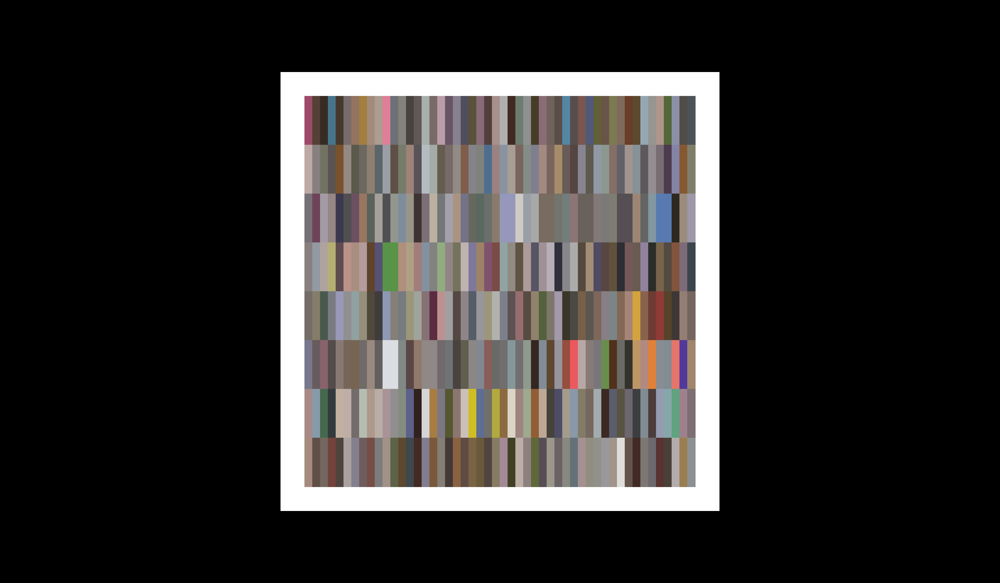
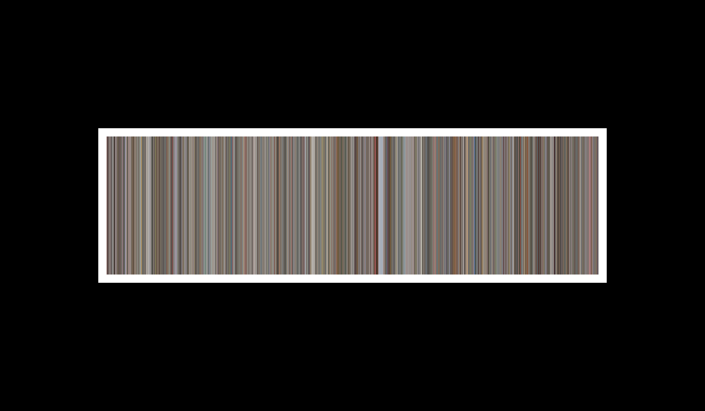
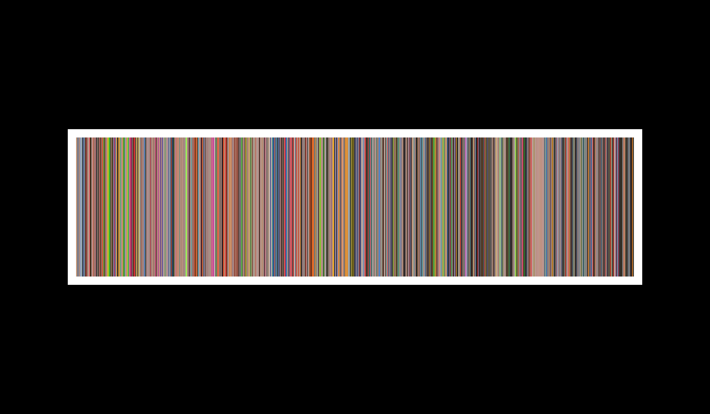
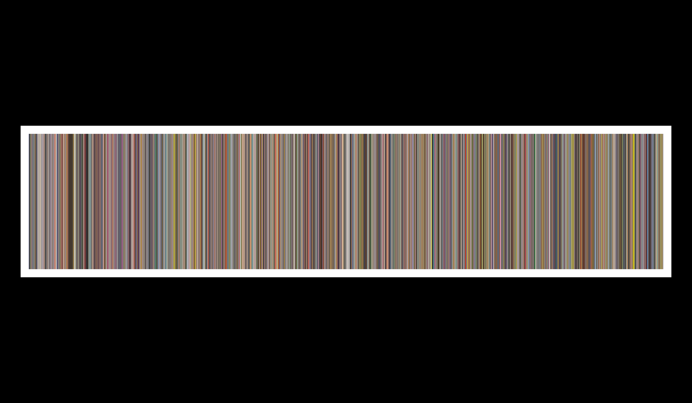
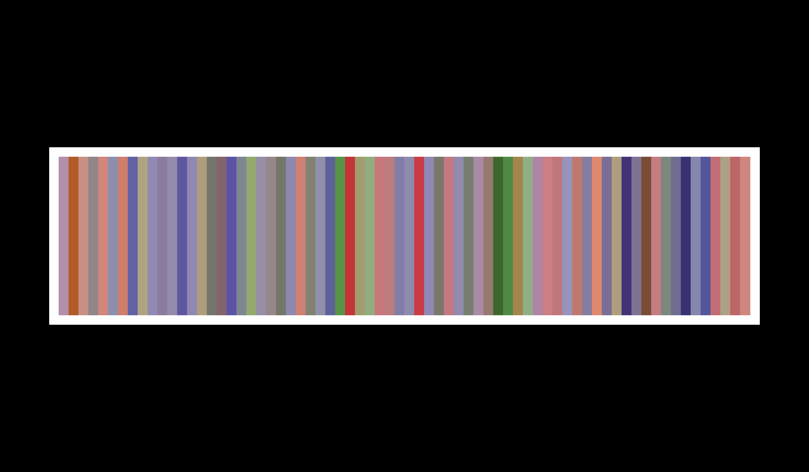

# # reCover 🕹️



On Reddit, I found images generated by the average color of each frame in the movies. I decided to do the same with video game covers over the generations. 

However, I wasn't able to find a satisfactory data set on the web. But I did find a website called [The Cover Project](https://www.thecoverproject.net/) which allows me to download a large number of images one by one. To speed up the process, I wrote a Python crawler that was able to download a large number of images from this website very efficiently (~10 hours of scripting on my PC). 

I ended up with ~30,000 video game covers.

## How to run the code (Not possible for the moment = the dataset is stored locally)

1. Clone the repository to your local machine
```console
git clone https://github.com/UnMoutonPerdu/generative-art/
```

2. Go to the `games` folder.

3. Open the `.html` file from the project in your favorite browser.

4. In the `sketch.js` file, choose:
    - `mode=0` to get the grid as above. 50 random covers by generation (Top to Down: 2nd Gen to 9th Gen).
    - `mode=1` to obtain a single line with the average color of all covers for a given console, as shown below

## Examples generated by the algorithm 







## Things to do 

- [ ] Put the dataset somewhere to make it accessible (maybe [Zenodo](https://zenodo.org/))
- [ ] Store all average color in a `.json` file (console_name, videogame_name, avg_color)