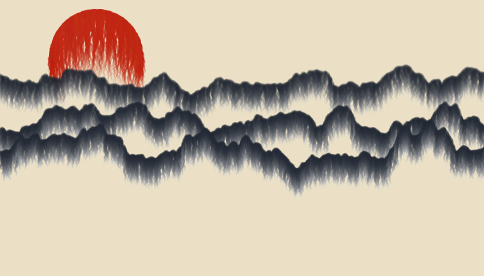

# Mountains :sunrise_over_mountains:



I tried to recreate the kind of Japanese drawing I like to see with the sunset and the mountains, using an inky effect.

## How to run the code 

1. Clone the repository to your local machine
```console
git clone https://github.com/UnMoutonPerdu/generative-art/
```

2. Go to the `ink-mountains` folder.

3. Open the `.html` file from the project in your favorite browser.