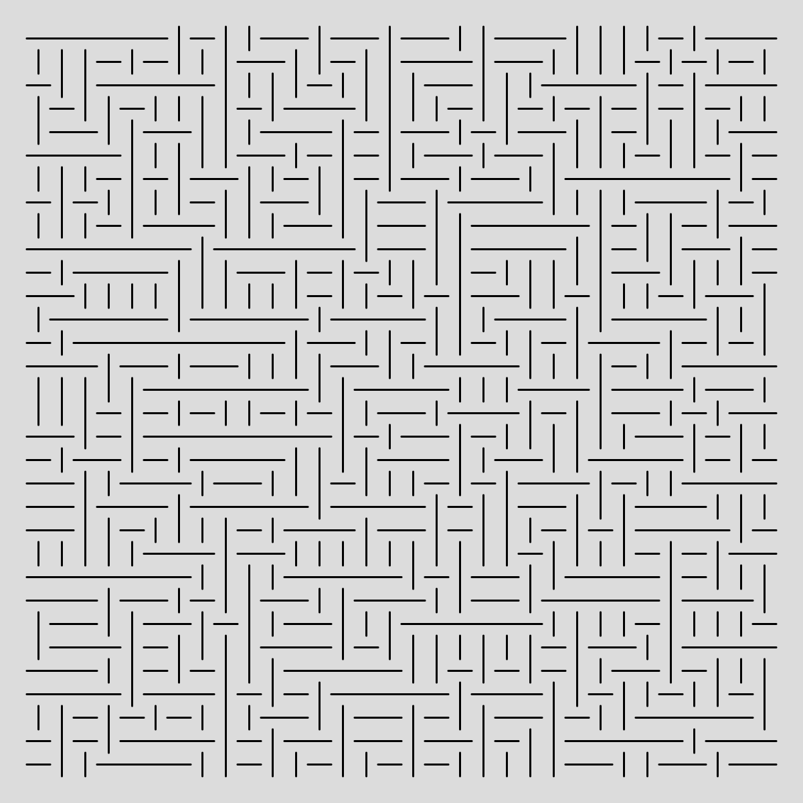
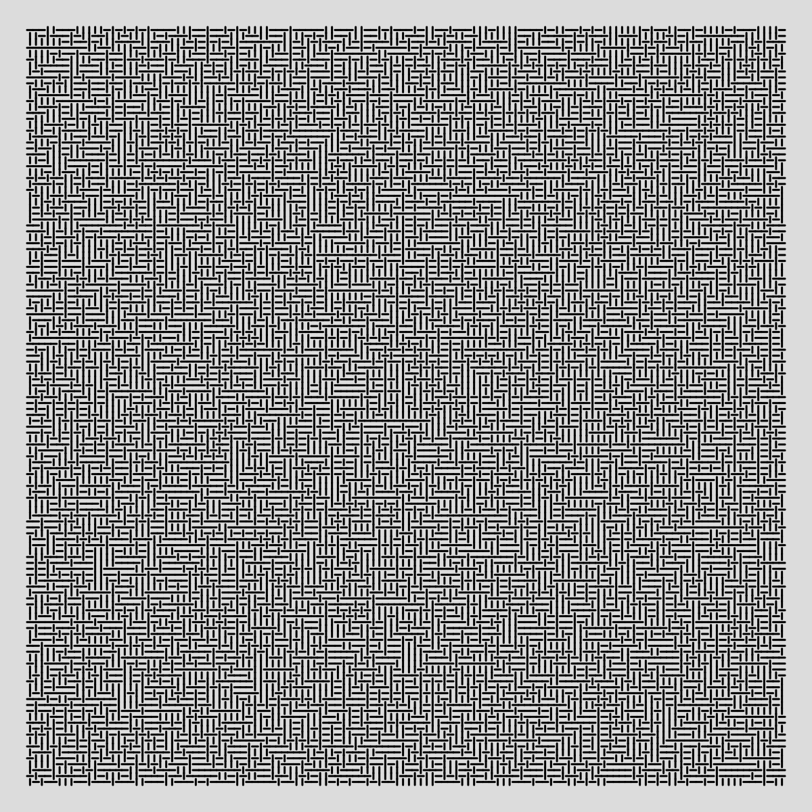
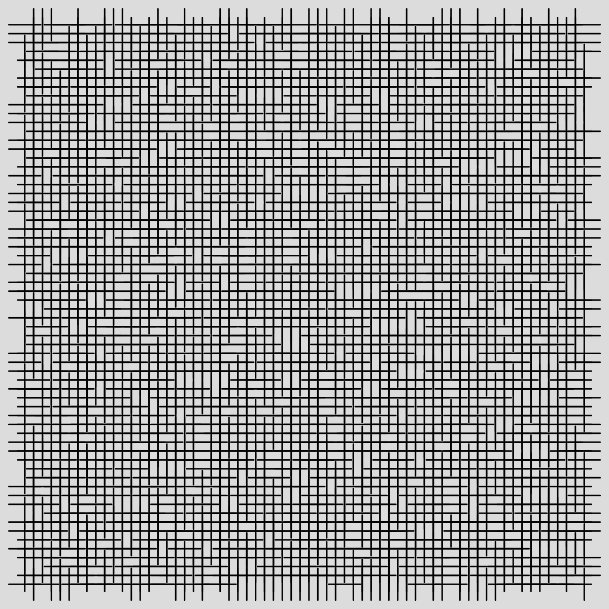
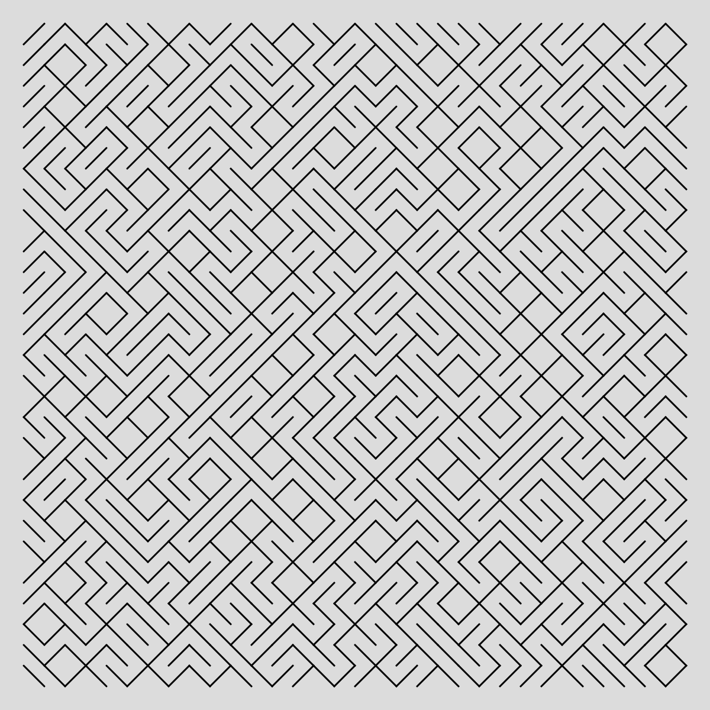
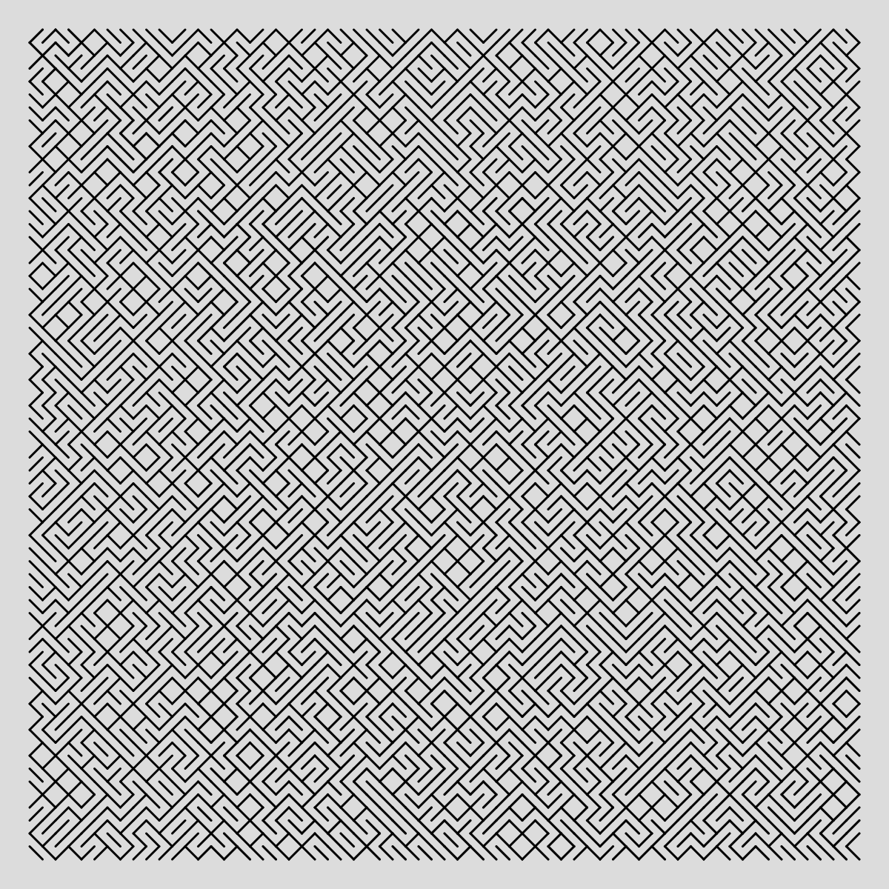
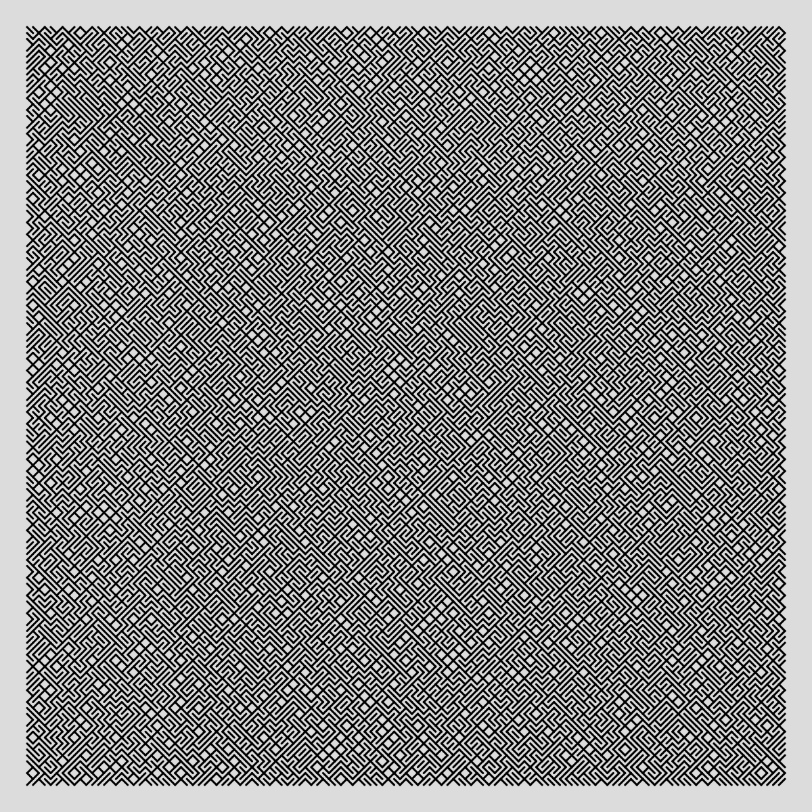
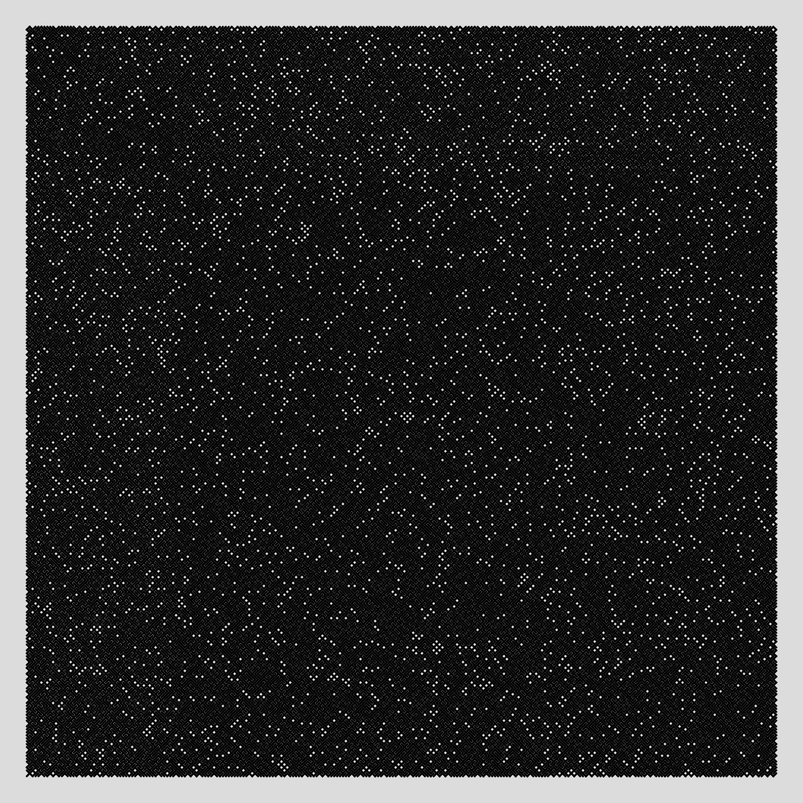

# Labyrinth

Based on genuary 2025 #1.

## Horizontal and Vertical lines




The following was unexpected due to an error in the way I coded the lines but I kind of like the result:



## Diagonal lines





## How to run the code 

1. Clone the repository to your local machine
```console
git clone https://github.com/UnMoutonPerdu/generative-art/
```

2. Go to the `labyrinth` folder.

3. Open the `.html` file from the project in your favorite browser.