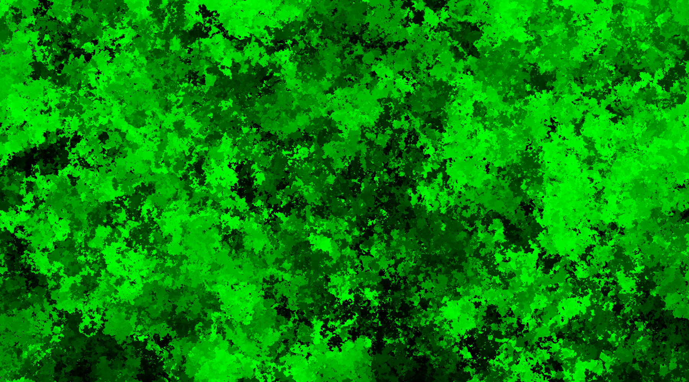
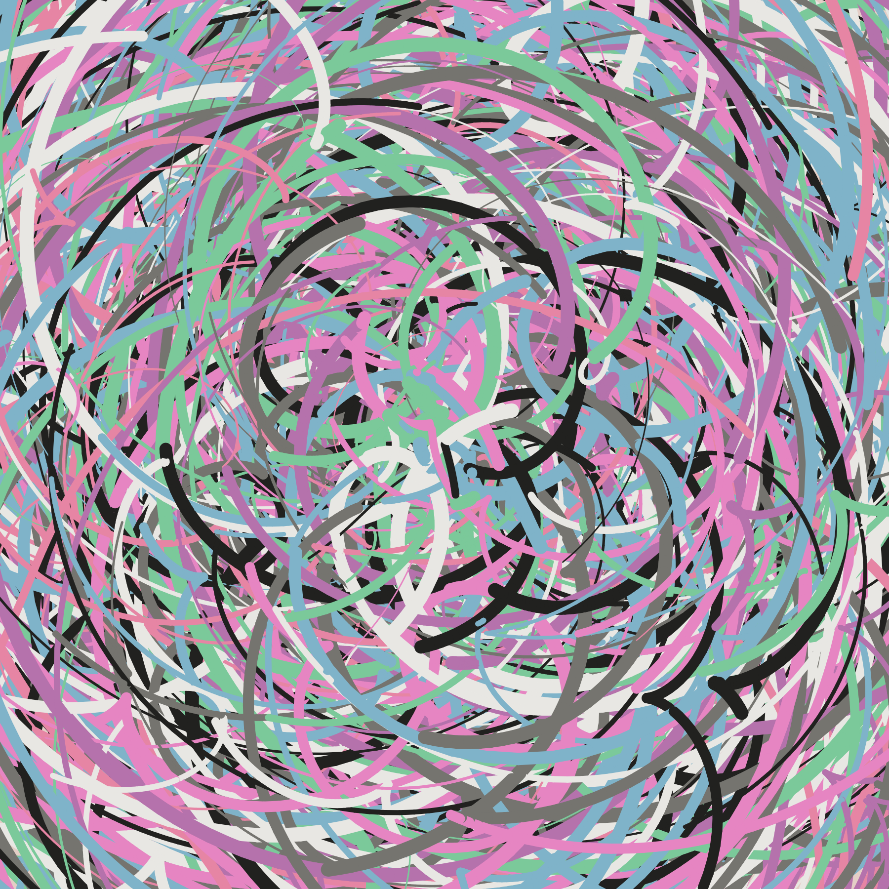

# Random Walker





## How to run the code 

1. Clone the repository to your local machine
```console
git clone https://github.com/UnMoutonPerdu/generative-art/
```

2. Go to the `random-walker` folder.

3. Open the `.html` file from the project in your favorite browser.