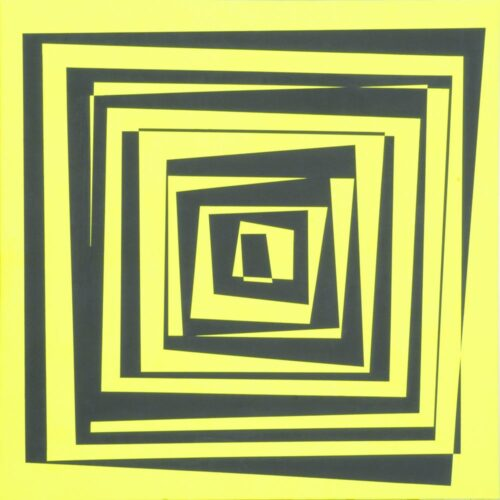

# IFT6251 - TP - Vera Molnar



Vera Molnar, *Transformations (jaune)*, 1975.

## How to run the code 

1. Clone the repository to your local machine
```console
git clone https://github.com/UnMoutonPerdu/generative-art/
```

2. Go to the `tunnel` folder.

3. Open the `.html` file from the project in your favorite browser.